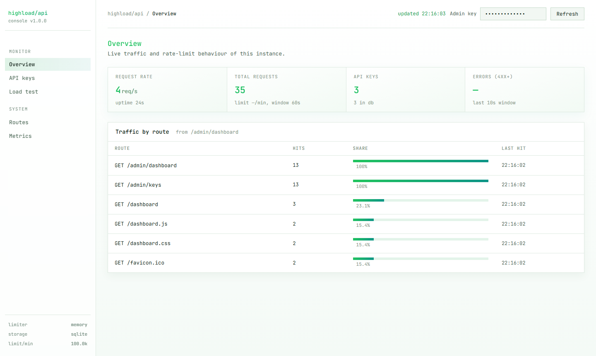
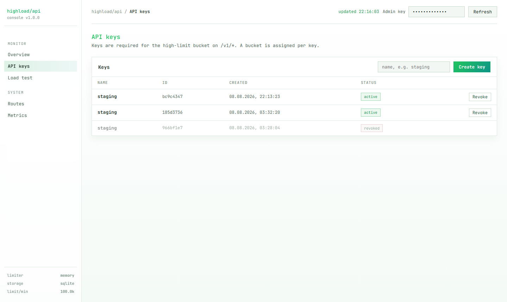
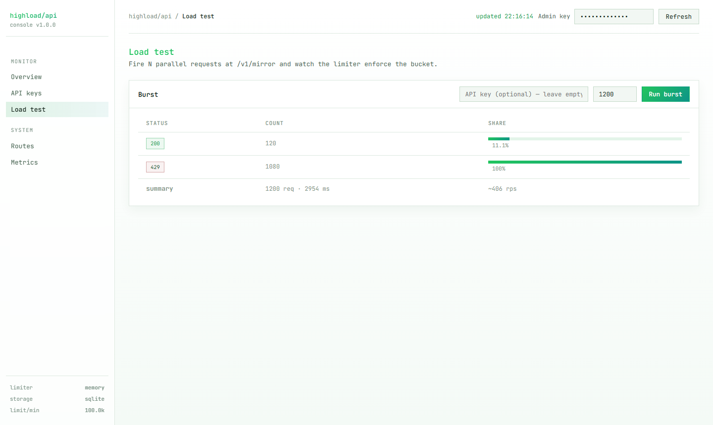

# High-Load API

> Fastify + TypeScript service with pluggable rate limiting and storage, admin dashboard
> and a zero-dependency local startup.

[](https://www.typescriptlang.org/)
[](#quick-start)
[](https://fastify.dev/)
[](https://vitest.dev/)
[](#license)

A production-shaped HTTP API service: pluggable sliding-window rate limiter
(in-memory or Redis Lua), SQLite or PostgreSQL storage, API key management,
an admin dashboard and load benchmarks. Runs with **zero external infrastructure**,
production backends are switched on with env vars — no code changes.

---

## Features

- **Rate limiting**: sliding window (two-bucket rolling count), per-API-key buckets
  plus anonymous per-IP buckets (120 rpm); `429` + `Retry-After` on refusal.
- **Two limiter stores**: in-memory (O(1) amortized) and Redis (atomic Lua `zset` ops)
  for distributed nodes — same interface, swap by env var.
- **Storage repository pattern**: SQLite (`better-sqlite3`) by default,
  PostgreSQL via `DATABASE_URL`.
- **API keys**: stateless validation through a TTL LRU cache (5 s) — the hot path
  never hits the database per request; create/revoke via admin API or the dashboard.
- **Admin dashboard** (`/dashboard`): live per-route counters, key management,
  and a burst limiter test.
- **Type-safe config**: env vars validated with `zod` at start — misconfigurations
  fail fast with a clear message.
- **Tests**: vitest suites for both stores and the rate-limit ladder.

## Quick start (zero infrastructure)

```bash
npm install
npm run dev        # starts on http://localhost:3000 (in-memory limiter + SQLite)
```

No Docker, no PostgreSQL, no Redis required for local runs.

```bash
curl http://localhost:3000/health          # { "status": "ok", "store": "sqlite", ... }
curl "http://localhost:3000/v1/mirror"     # echo with id + timestamp
curl -X POST http://localhost:3000/v1/echo \
     -H "content-type: application/json" -d '{"text":"hello"}'   # validated echo
```

## API surface

### Public

| Method | Path        | Purpose                                                        |
|--------|-------------|----------------------------------------------------------------|
| GET    | `/health`   | Liveness probe (reports store type too)                        |
| GET    | `/v1/mirror`| High-RPS echo: request id, timestamp, user-agent               |
| POST   | `/v1/echo`  | Validated payload echo (schema enforced, `text` ≤ 1024)        |
| GET    | `/v1/rate`  | Current rate-limit status for your IP                          |

Errors align with `X-RateLimit-*` headers:

```
HTTP/1.1 429 Too Many Requests
X-RateLimit-Limit: 120
X-RateLimit-Remaining: 0
Retry-After: 7
```

### Admin (header `X-Admin-Key`, default `dev-admin-key`)

| Method | Path                     | Description                  |
|--------|--------------------------|------------------------------|
| GET    | `/admin/keys`            | List API keys                |
| POST   | `/admin/keys`            | Create API key               |
| DELETE | `/admin/keys/:id`        | Revoke API key               |
| GET    | `/admin/stats`           | Per-route request counters   |
| GET    | `/admin/quota`           | Per-key rate-limit snapshot  |
| GET    | `/admin/dashboard`       | Aggregate data for the web dashboard |

```bash
curl -X POST http://localhost:3000/admin/keys \
     -H "x-admin-key: dev-admin-key" \
     -H "content-type: application/json" -d '{"name":"staging"}'

# { "ok": true, "id": "bc9c4347", "name": "staging",
#   "key": "hl_81Ac8...", "createdAt": 1786216403206 }
```

Only the key **secret** (`hl_...`) is printed once at creation — the server stores a
blake3 hash only (see `src/lib/auth.ts`). Use the secret in `x-api-key`.

## Rate limiting

`src/lib/rladder/` implements a **sliding-window counter** (two-bucket rolling
count) through a tiny `RateLimiter` interface:

- **memory** (default): O(1) amortized — fine for a single node.
- **redis**: atomic Lua `zset` operations — consistent across nodes.

| Bucket            | Limit            | Key |
|-------------------|------------------|-----|
| Anonymous (per IP)| 120 rpm          | `ip:{ip}` |
| API key           | `RATE_LIMIT_PER_MIN` (default 600) | `key:{id}` |

API keys are resolved via TTL LRU cache (`src/lib/lru.ts`, 5 s TTL), so the hot
path performs **zero database round-trips** per request.

## Storage

`src/lib/storage/` — small repository interface, two drivers:

| Driver      | Selected by                             | Notes |
|-------------|-----------------------------------------|-------|
| **sqlite**  | default (`data/app.db`, `better-sqlite3`) | zero setup |
| **postgres**| `DATABASE_URL=postgres://...`           | production picks |

## Dashboard

Served by Fastify as static files — no build step, no frameworks.

| Dashboard |
|-----------|
|  |
|  |
|  |

## Load benchmarks

```bash
npm run bench         # autocannon: 15 s × 50 connections, GET /v1/mirror
npm run bench:post    # autocannon: 15 s × 50 connections, POST /v1/echo
```

Measured locally (one process, memory limiter + SQLite, Node 22, no external
infrastructure; key bucket sized at 100 000 rpm so the limiter does not mask
raw throughput):

| Scenario                    | Throughput        | p50   | p97.5 | Max   |
|-----------------------------|-------------------|-------|-------|-------|
| `GET /v1/mirror` with key   | ~4 900 req/s (74k/15 s) | 9 ms | 18 ms | 48 ms |
| `POST /v1/echo` with key    | ~3 700 req/s (56k/15 s) | 11 ms | 30 ms | 174 ms |

When burst traffic exceeds the configured limit the limiter responds `429`
with `Retry-After` — this is by design, not a failure.

## Production mode

```bash
docker compose up --build
```

or swap `RATE_STORE=redis` + `DATABASE_URL=postgres://...` — drivers implement the
same interface, no code changes.

## Environment

| Var              | Default              | Meaning |
|------------------|----------------------|---------|
| `PORT`           | `3000`               | HTTP port |
| `ADMIN_KEY`      | `dev-admin-key`      | Admin auth header |
| `RATE_STORE`     | `memory`             | `memory` or `redis` |
| `REDIS_URL`      | —                    | Used when `RATE_STORE=redis` |
| `DATABASE_URL`   | `sqlite:./data/app.db` | `postgres://...` switches the driver |
| `RATE_LIMIT_PER_MIN` | `600`            | Per-key rpm (1–100 000) |
| `LOG_LEVEL`      | `info`               | pino level |

## Development

```bash
npm run dev         # tsx watch
npm run typecheck   # tsc --noEmit
npm test            # vitest run
npm run build       # tsc → dist/
```

## Project layout

```
src/
  app.ts          Fastify bootstrap
  server.ts       entry
  config.ts       env parsing & validation (zod)
  lib/
    rladder/      rate limiter: memory + redis + lua
    storage/      repository interface: sqlite + postgres
    lru.ts        tiny TTL cache
    auth.ts       API key hashing + generation
    logging.ts    pino setup
  routes/         public.ts · admin.ts · health.ts · metrics.ts
tests/            vitest (stores + limiter)
web/              static dashboard (plain HTML/JS, served by Fastify)
docs/             dashboard screenshots for this README
```

## License

MIT — see [LICENSE](LICENSE). © 2026 Alex Black.